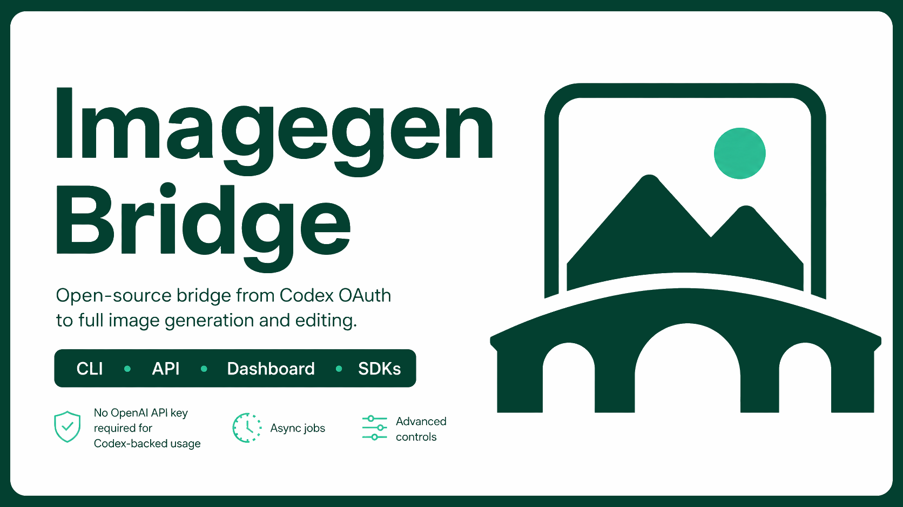

---
hide:
  - navigation
  - toc
---

<section class="ib-hero">
  <div class="ib-hero__copy">
    <p class="ib-kicker">Codex OAuth image generation</p>
    <h1>Codex images. One bridge.</h1>
    <p class="ib-hero__lede">Use your Codex subscription through a CLI, private API, dashboard, or typed SDK. No OpenAI API key.</p>
    <div class="ib-actions">
      <a class="ib-button ib-button--primary" href="cli/">Install the CLI</a>
      <a class="ib-button ib-button--secondary" href="api/">Explore the API</a>
    </div>
  </div>
  <figure class="ib-hero__visual">
    
  </figure>
</section>

<dl class="ib-facts">
  <div>
    <dt>Authentication</dt>
    <dd>Existing Codex and ChatGPT OAuth session</dd>
  </div>
  <div>
    <dt>Default path</dt>
    <dd><code>codex-responses</code> with the Codex Responses backend</dd>
  </div>
  <div>
    <dt>Deployment</dt>
    <dd>Native binary or hardened multi-architecture container</dd>
  </div>
</dl>

## Start where you are

<div class="ib-paths" markdown>
  <a class="ib-path ib-path--cli" href="cli/">
    <span class="ib-path__label">Local workflow</span>
    <strong>Generate from the command line</strong>
    <span>Guided setup, diagnostics, generation, editing, presets, sessions, and verified output files.</span>
    <span class="ib-path__link">Read the CLI guide</span>
  </a>
  <a class="ib-path ib-path--api" href="api/">
    <span class="ib-path__label">Service workflow</span>
    <strong>Connect tools through one private API</strong>
    <span>Bearer authentication, synchronous and streaming requests, durable jobs, metrics, and OpenAPI.</span>
    <span class="ib-path__link">Read the API contract</span>
  </a>
</div>

## One contract across every surface

Imagegen Bridge normalizes requests, capability negotiation, metadata, errors, and provider attempts before they reach either supported Codex transport.

<div class="ib-surface-list" markdown>
  <div>
    <strong>CLI and dashboard</strong>
    <span>Interactive setup for people, complete JSON modes for automation.</span>
  </div>
  <div>
    <strong>HTTP and OpenAPI</strong>
    <span>A private network service with bounded payloads and stable error codes.</span>
  </div>
  <div>
    <strong>Python and TypeScript</strong>
    <span>Typed HTTP clients with streaming, deadlines, jobs, and diagnostics.</span>
  </div>
  <div>
    <strong>Rust</strong>
    <span>Embed the complete runtime or register a compatible in-process provider.</span>
  </div>
</div>

## The default Codex path

```text
Your application
      |
      |  CLI, SDK, or authenticated HTTP
      v
Imagegen Bridge
      |
      +-- codex-responses     default and recommended
      |
      +-- codex-app-server    supported compatibility fallback
      |
      v
Codex / ChatGPT OAuth
```

`codex-responses` uses the Codex Responses backend and your existing Codex login. It does not read `OPENAI_API_KEY`. The `codex-app-server` transport remains available for compatibility, edits, references, and reusable Codex threads.

## Continue with the guide you need

<nav class="ib-doc-map" aria-label="Documentation guides">
  <a href="cli/"><strong>CLI</strong><span>Install, configure, generate, and diagnose.</span></a>
  <a href="api/"><strong>API</strong><span>Routes, authentication, jobs, streaming, and errors.</span></a>
  <a href="sdks/"><strong>SDKs</strong><span>Rust, Python, and TypeScript integration.</span></a>
  <a href="deployment/"><strong>Deployment</strong><span>OAuth state, Compose, backups, and upgrades.</span></a>
  <a href="testing/"><strong>Testing</strong><span>Offline gates, OAuth smoke tests, and dashboard QA.</span></a>
  <a href="releasing/"><strong>Releasing</strong><span>Registry setup and the coordinated release process.</span></a>
</nav>
